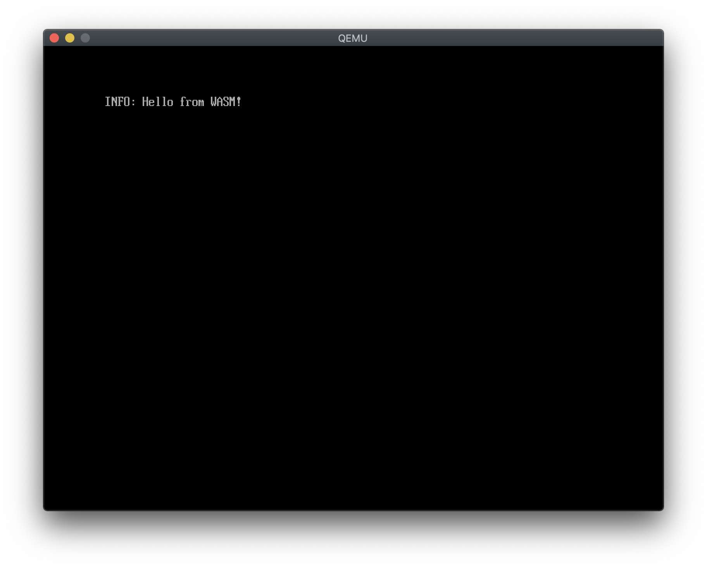

# WASM kernel

Pushing forward the [_Birth and Death of Javascript_](https://www.destroyallsoftware.com/talks/the-birth-and-death-of-javascript) one step at a time.

**tl;dr:** To run this follow the _Setup instructions_ then run `make`. You'll almost certainly get errors that you'll have to
work through, because this was done in like 4 hours so set your expectations accordingly.

## What is this?

This is a small Rust project that produces a bootable binary with an embedded WebAssembly interpreter. It can boot in QEMU (I
haven't tried real hardware) using the included UEFI firmware, then execute WebAssembly binaries.

It's basically what happens if you take [`uefi-rs`](https://crates.io/crates/uefi) in one hand and 
[`wasmi`](https://crates.io/crates/wasmi) in the other hand, and try to stick them together. They had an enormous fight, and
when they were done WebAssembly was booting on UEFI firmware.



That text comes from a Rust application in `extern/init` that gets compiled to WebAssembly and embedded into the kernel binary then interpreted.

## Setup instructions

```
brew install qemu
cargo install cargo-xbuild
rustup toolchain add nightly-2019-03-16
rustup component add wasm32-unknown-unknown
```

At this point, running `make` should start QEMU and show `INFO: Hello from WASM!` as seen in the screenshot above.
